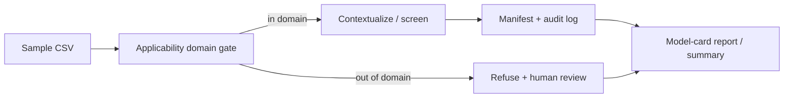

[](https://doi.org/10.5281/zenodo.20425189)
# PFAS Enterprise 5.0

Human-centered PFAS screening intelligence platform.

PFAS Enterprise 5.0 helps laboratories, consultants, and environmental teams harmonize PFAS data, screen samples, generate model-card reports, route uncertain results to human review, and track sustainability impact.

> **Positioning:** Governed, reproducible PFAS **decision-support infrastructure**—frozen releases, provenance, and human-reviewed screening—not a replacement for accredited laboratories. **RUO only.**

**Reality check:** This repository is a **technical prototype / research scaffold** with compliance-oriented *architecture*, not a certified regulatory or analytical product. Read **[DISCLAIMER.md](DISCLAIMER.md)** and the **[Governance index](docs/GOVERNANCE_INDEX.md)** for scope, limitations, and reproducibility artifacts.

## Workflow (high level)



## Quick start (reproducibility)

Blind reviewers and operators verifying the frozen serum release:

```bash
git clone https://github.com/Ishola-github/pfas-enterprise-modular.git
cd pfas-enterprise-modular
git checkout serum-v2.0.0-temporal
bash scripts/repro_one_shot.sh
```

**PASS** ends with `ONE_SHOT_REPRO: PASS` and `=== Linux verify: ALL PASS ===`. See **[validation/serum_demo_v1/ONE_COMMAND_REPRO.md](validation/serum_demo_v1/ONE_COMMAND_REPRO.md)**.

## Documentation screenshots

Add PNGs under [`docs/images/`](docs/images/) (see checklist there), then uncomment the gallery in README:

- **workflow_upload.png** — sample intake
- **dashboard_shiny.png** — screening UI
- **report_pdf.png** — governed report output
- **provenance_manifest.png** — manifest / audit trail
- **governance_ci_green.png** — Governance Checks PASS on `8ce2492`

```markdown
<!-- Gallery (enable after PNGs exist):


-->
```

## 5.0 Pillars

| Pillar | Purpose |
|--------|---------|
| Model Card PDF | OECD-style defensibility and client reporting |
| Provenance + Audit Log | Traceable run history, model version, recipe ID, report path |
| Human Review | QA approval, override, and reviewer notes |
| Applicability Domain Gate | Defers unknown samples to laboratory confirmation |
| Sustainability Metrics | Estimates avoided cost and CO₂ impact |

## Intended Use

Screening decision-support only.

This platform is **not**:

- EPA-approved
- ISO-accredited
- a certified laboratory method
- a replacement for EPA Method 1633 or EPA Method 533
- a clinical diagnostic system

**Strict demo wording:** PFAS Enterprise 5.0 is a screening decision-support platform, not a certified laboratory replacement.

For a fuller statement of what the software **can and cannot** honestly claim today (portfolio / R&D uses, screening vs regulatory use, analytical chemistry boundaries, and suggested next steps), see **[DISCLAIMER.md](DISCLAIMER.md)**.

## Reproducibility and grants

Frozen serum reproducibility release **`serum-v2.0.0-temporal`** (commit `8ce2492`): **[Zenodo](https://doi.org/10.5281/zenodo.20425189)** · **[GitHub Release](https://github.com/Ishola-github/pfas-enterprise-modular/releases/tag/serum-v2.0.0-temporal)** · evidence summary **[validation/public_reproducibility_summary.md](validation/public_reproducibility_summary.md)**.

Grant-safe **ISO/IEC 17025 workflow support** wording (not certification): **[docs/grants/ISO_17025_WORKFLOW_SUPPORT_BLURB.md](docs/grants/ISO_17025_WORKFLOW_SUPPORT_BLURB.md)**.

**Governance hub:** **[docs/GOVERNANCE_INDEX.md](docs/GOVERNANCE_INDEX.md)** — reproducibility, pilot freeze, attestation, safe public narrative.

## Shiny front ends

**RStudio:** In the **R Console** (not PowerShell), set the API base if needed, then Run App. The sidebar includes **Scope & limitations**, which embeds **`DISCLAIMER.md`** from the app directory (with a GitHub link if the file is missing).

**Data & Endpoints** includes an optional **UCMR5 Method 533** panel: set **`UCMR5_533_TXT`** or **`options(pfas.ucmr5_533_path)`** before `runApp`, use the path override field, or place **`UCMR5_533.txt`** under **`data/external/epa_ucmr5/`**, then **Load preview** (reads only the first N rows for memory safety).

After **`python pipeline/process_ucmr5.py ... --run-id YOUR_ID`**, use **Python pipeline output (priority triage)** on the same tab: set **Run ID** to **`YOUR_ID`** (and **Output root** if not **`runs`**), then **Load priority report** (preview capped at N rows).

```r
Sys.setenv(PFAS_API_URL = "https://pfas-enterprise-5.onrender.com")
# shiny::runApp()  or  Run App on app.R
```

In **PowerShell**, `Sys.setenv(...)` is invalid. Use `$env:PFAS_API_URL = "https://..."` for tools you launch from that shell only.

**RStudio — use the right tab:** The **Console** runs **R code only** (`source()`, `Sys.setenv()`, `shiny::runApp()`). Do **not** paste `Rscript ...`, `.\run_shiny_app.ps1`, or `Set-Location "C:\..."` there — those belong in **Terminal** (or external PowerShell). In the Console, run diagnostics with  
`source("scripts/check_r_environment.R", encoding = "UTF-8")`  
after **`Session → Set Working Directory → To Project Directory`** (or **`setwd(...)`** to your repo root).

**PowerShell — execution policy:** If `.\run_shiny_app.ps1` says scripts are disabled, either allow scripts for your user once:  
`Set-ExecutionPolicy -Scope CurrentUser -ExecutionPolicy RemoteSigned`  
or run a single session without changing policy:  
`powershell -NoProfile -ExecutionPolicy Bypass -File .\run_shiny_app.ps1`

**Paths:** Replace any placeholder like `C:\path\to\repo-root` with your real folder (the one where **`Test-Path .\LatestPFAS.R`** is **`True`**), e.g.  
`Set-Location "C:\Users\you\OneDrive\Desktop\python_work\PFAS_on_R_Studio"`  
(or **`...\pfas-enterprise-modular`** if that is where the clone lives).

**RStudio Console vs Terminal:** The **Console** (prompt `>`) runs **R** only. Lines like **`Set-Location`**, **`& $Rscript`**, **`.\run_shiny_app.ps1`**, or **`\scripts\...`** belong in **RStudio’s Terminal** tab (PowerShell), not in the Console. In the Console, use R instead, for example:

```r
setwd("C:/Users/you/OneDrive/Desktop/python_work/PFAS_on_R_Studio")  # use / not \, real path
source("scripts/check_r_environment.R")
shiny::runApp(".", port = 3838, launch.browser = TRUE)
```

**PowerShell working directory:** Shell commands that use **`.\scripts\...`** must be run from the **repo root**. If you start in **`C:\Users\techj`** (or your home folder), **`find_rscript.ps1`** is missing, PowerShell may still print a message, and **`$Rscript = @(...)[0]`** can capture that **error text** so the next **`& $Rscript`** fails. Before calling **`find_rscript`**, run:

```powershell
Set-Location "C:\path\to\your\repo-root"   # folder where LatestPFAS.R lives
Test-Path .\LatestPFAS.R
Test-Path .\scripts\find_rscript.ps1
```

Both should be **`True`**.

**Paste two commands separately:** If you run **`powershell ... -File .\run_shiny_app.ps1`** and **`Set-Location "..."`** on the **same line** without a space or **`;`**, PowerShell treats **`.\run_shiny_app.ps1Set-Location`** as one bad filename. Use **Enter** between commands, or one line with a semicolon, e.g.  
`Set-Location "C:\path\to\repo"; powershell -NoProfile -ExecutionPolicy Bypass -File .\run_shiny_app.ps1`

**Launch Shiny without `cd` first:** With an up-to-date clone, you can pass the **full path** to the repo’s **`run_shiny_app.ps1`** from any working directory (for example `C:\Users\techj`):

```powershell
powershell -NoProfile -ExecutionPolicy Bypass -File "C:\Users\you\OneDrive\Desktop\python_work\PFAS_on_R_Studio\run_shiny_app.ps1"
```

Use the folder that contains **`LatestPFAS.R`** (adjust if your clone is nested). The launcher resolves the app directory from the script location, not from **`Get-Location`**.

**RStudio vs `Rscript`:** They may use **different R executables** and **different package libraries**. Packages can appear installed in RStudio but be missing when you run `Rscript` in PowerShell. Compare environments with:

```powershell
Rscript scripts/check_r_environment.R
```

Run the same in **RStudio** via **Source** or `source("scripts/check_r_environment.R")` and diff the output.

**PowerShell + `Rscript`:** Packages install under your **per-user** library (not `C:\Program Files\R\...` unless you run as Administrator). On Windows this is often **`%LOCALAPPDATA%\R\win-library\<x.y>`** or **`%USERPROFILE%\Documents\R\win-library\<x.y>`** — they can differ between machines and R versions. Scripts **`scripts/_win_user_lib.R`** / **`r_user_lib_path.R`** respect **`R_LIBS_USER`** if set, otherwise pick an existing folder or default to LocalAppData. Either use **RStudio** (its configured R + library), or:

1. **`run_shiny_app.ps1`** (recommended): sets **`R_LIBS_USER`**, runs **`install_r_deps_win_user_lib.R` on every launch** (quick when nothing is missing; picks up newly added packages such as **`markdown`**), then starts **`shiny::runApp`**. Use **`.\run_shiny_app.ps1`** , **`.\scripts\run_shiny_app.ps1`** , or **`powershell -NoProfile -ExecutionPolicy Bypass -File "C:\full\path\to\repo\run_shiny_app.ps1"`** (full path works from any cwd after you **`git pull`** the latest launcher).
2. Manual / RStudio-only:  
   `Rscript --vanilla scripts/install_r_deps_win_user_lib.R`  
   then set **`R_LIBS_USER`** or open the project in RStudio and use its library.

**Repo root:** the folder that contains **`LatestPFAS.R`**, **`app.R`**, and **`run_shiny_app.ps1`** (not a parent folder). If **`.\run_shiny_app.ps1`** is missing, you may be one level too high (e.g. `PFAS_on_R_Studio` with the real clone in **`pfas-enterprise-modular\`**). Check:

```powershell
Test-Path .\LatestPFAS.R
Get-ChildItem -Path . -Recurse -Filter run_shiny_app.ps1 -ErrorAction SilentlyContinue | Select-Object -ExpandProperty FullName
```

Then **`Set-Location`** into that directory and run the script again.

**Find `Rscript.exe` (do not type `R-4.x.x` - that is not a real folder on your PC):** In PowerShell.

If **`find_rscript.ps1` is blocked** by execution policy when you call it with `&`, spawn a **one-off** process with **Bypass** (this is the usual fix when `Restricted` blocks scripts in the current session):

```powershell
powershell -NoProfile -ExecutionPolicy Bypass -File ".\scripts\find_rscript.ps1"
```

Assign the path (same Bypass pattern; only after **`Set-Location`** to repo root so **`.\scripts\find_rscript.ps1`** exists):

```powershell
$Rscript = @(powershell -NoProfile -ExecutionPolicy Bypass -File ".\scripts\find_rscript.ps1")[0].Trim()
if (-not (Test-Path -LiteralPath $Rscript)) {
  throw "find_rscript did not return a valid path. Are you in the repo root? Got: $Rscript"
}
```

No script file needed — read the install folder from the registry, then append `\bin\Rscript.exe`:

```powershell
( Get-ItemProperty "HKLM:\SOFTWARE\R-core\R" ).InstallPath
```

Then build the path yourself, e.g. `...\R-4.6.0\bin\Rscript.exe` (your version will differ). Or list installs:

```powershell
Get-ChildItem "C:\Program Files\R" | ForEach-Object { Join-Path $_.FullName "bin\Rscript.exe" } | Where-Object { Test-Path $_ }
```

**Without the full Shiny launcher** — from the repo root. Use the **same** `Rscript.exe` for install and for `runApp`:

```powershell
$Rscript = @(powershell -NoProfile -ExecutionPolicy Bypass -File ".\scripts\find_rscript.ps1")[0].Trim()
if (-not (Test-Path -LiteralPath $Rscript)) { throw "Bad Rscript path: $Rscript" }
$lib = (& $Rscript --vanilla .\scripts\r_user_lib_path.R).Trim()
$env:R_LIBS_USER = $lib
& $Rscript --vanilla .\scripts\install_r_deps_win_user_lib.R
& $Rscript -e "shiny::runApp('.', port=3838, launch.browser=TRUE)"
```

(`shiny::runApp` takes an **application directory** that contains `app.R`, not the filename `app.R` alone.)

If **Git** says *no tracking information for the current branch*, set upstream once:  
`git branch --set-upstream-to=origin/main main` then `git pull` (or after a **force push**: `git fetch origin` and `git reset --hard origin/main` only if you accept losing unpushed local commits).

**`refusing to merge unrelated histories`:** the folder had a separate initial commit vs `origin/main`. Use **`git fetch origin`** then **`git reset --hard origin/main`** to match GitHub (discard local-only history), or re-clone into a new folder.

If **`git reset`** warns it **cannot unlink** `pfas_collection.sqlite`, close **RStudio** / any app using that file, then run **`git reset --hard origin/main`** again (or delete the locked file after backup, only if safe).

Install R packages for full `LatestPFAS.R` once: rely on **`scripts/install_r_deps_win_user_lib.R`** or in R:  
`install.packages(c("shiny", "shinydashboard", "shinymanager", "DT", "ggplot2", "dplyr", "tidyr", "tibble", "purrr", "stringr", "scales", "jsonlite", "httr", "digest", "DBI", "RSQLite", "markdown"))`

- **`app.R`** — **Default Run App entry:** loads **`LatestPFAS.R`**, which includes sidebar **Enterprise 5.0 (Cloud API)** (`POST /predict` via **`PFAS_API_URL`**) plus the full dashboard, GLP, and data-collection workflows.
- **`app_enterprise4_latestpfas.R`** — Same as **`app.R`** (thin `source("LatestPFAS.R")` loader); kept for older docs/scripts that reference this filename.
- **`app_oecd_predictive_tox_skeleton.R`** — OECD/QSAR documentation-style Shiny skeleton (placeholders).

## Local API test

From the repo root (`pfas-toxicology/`). On Windows, prefer **`python -m uvicorn`** so you do not rely on the `Scripts` folder being on `PATH` (Store Python often warns that `uvicorn.exe` is not on `PATH`).

```bash
python -m uvicorn api.main:app --reload --host 127.0.0.1 --port 8000
```

Equivalent if `uvicorn` is on your `PATH`:

```bash
uvicorn api.main:app --reload --host 127.0.0.1 --port 8000
```

Health check:

```bash
curl http://127.0.0.1:8000/healthz
```

Prediction:

```bash
curl -X POST http://127.0.0.1:8000/predict \
  -H "Content-Type: application/json" \
  -d "{\"sample_id\":\"DEMO_001\",\"dtxsid\":\"DTXSID8030271\",\"method_id\":\"EPA_533\",\"matrix\":\"water\"}"
```

## Deployment

Deploy using:

- `Dockerfile` (build context is repo root; `.dockerignore` excludes large local `data/`, legacy trees, and Shiny-only artifacts)
- `render.yaml` (Blueprint: Docker web service + PostgreSQL on a **current** instance type, e.g. `basic-256mb`; legacy DB `starter` is rejected for new databases)
- PostgreSQL from the blueprint (optional for the current demo API stub; connect in code when you add persistence)
- Environment variables from `.env.example`

### Render (Blueprint)

1. In [Render](https://render.com): **New** → **Blueprint**.
2. Connect your GitHub account and select the repo that contains this `Dockerfile` and `render.yaml` (for example **`pfas-enterprise-modular`** or this project’s canonical remote).
3. Review the detected services and **Apply**.

After deploy, substitute your service URL:

- `https://<your-service>.onrender.com/healthz`
- `POST https://<your-service>.onrender.com/predict`

Use this line in demos and UI footers:

> PFAS Enterprise 5.0 is a screening decision-support platform, not a certified laboratory replacement.

## Demo tagline

Not a lab replacement. A force multiplier for the humans who run them.
